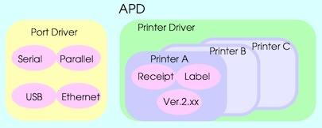
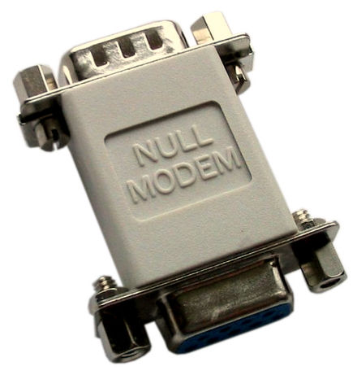
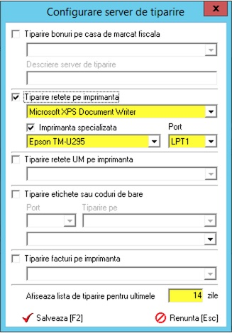

# Instalare EPSON TM-U295 / TM-U295P

- [Instalare EPSON TM-U295 / TM-U295P](#instalare-epson-tm-u295--tm-u295p)
  - [Introducere](#introducere)
  - [Setări DIP Switch](#setări-dip-switch)
    - [Interfața serială](#interfața-serială)
    - [Viteza de transmisie serială](#viteza-de-transmisie-serială)
  - [LEDuri panou frontal](#leduri-panou-frontal)
  - [Conectare imprimantă la calculator](#conectare-imprimantă-la-calculator)
  - [Instalare driver APD](#instalare-driver-apd)
  - [Instalare EPSON TM Virtual Port Driver Port Assignment Tool](#instalare-epson-tm-virtual-port-driver-port-assignment-tool)
  - [Configurare imprimantă în BizPharma](#configurare-imprimantă-în-bizpharma)
  - [Finalizare](#finalizare)
  - [Recomandări](#recomandări)

## Introducere

BizPharma funcționează la momentul redactării doar cu imprimante matriciale EPSON pe port paralel (LPT), de obicei EPSON TM-U295P (varianta fără P este cea cu port serial).

Teoretic ar putea funcționa și cu cele pe port serial (COM), însă nu este implementată această funcționalitate.

Din teste rezultă că BizPharma comunică direct cu imprimantele acestea, nefiind nevoie de driver, însă ele au un protocol text de comunicare proprietar EPSON pe care BizPharma îl respectă doar atunci când este configurată imprimanta în varianta pe port LPT în setările ei.

Fiindcă porturile LPT sunt învechite, se folosesc adaptoare USB-LPT, însă aceste adaptoare sunt mai problematice decât cele USB-COM.

Există standarde LPT pentru imprimante care fac ca aceste imprimante, pe majoritatea convertoarelor USB-LPT, să nu se prezinte ca un port fizic LPT către sistemul de operare, ci ca niște imprimante USB plug and play.

BizPharma nu suportă acest lucru. De aceea este nevoie de un soft de la EPSON care se conectează la portul virtual al driverului APD de imprimantă Windows și emulează un port LPT sau COM fizic pentru aplicații mai vechi care nu pot tipări direct către o imprimantă Windows.

Conexiunea standard arată în felul următor:

```text
EPSON TM-U295 <-> Port COM virtual <-> EPSON APD Driver <-> Port virtual ESDPRT001 (instalat de APD) <-> Imprimanta Windows care permite oricărei aplicații să tipărească ca la orice imprimantă laser sau inkjet
```

Softul EPSON de emulare port fizic se numește `EPSON TM Virtual Port Driver Port Assignment Tool`. El se inserează în schema de mai sus în felul următor:

```text
EPSON TM-U295 <-> Port COM virtual <-> EPSON APD Driver <-> Port virtual ESDPRT001 (instalat de APD) <-> EPSON TM Virtual Port Driver care crează un port virtual LPT1 <-> BizPharma
```

EPSON TM Virtual Port Driver crează un port virtual LPT și translatează protocolul proprietar EPSON în ceva care se poate tipari prin driverul de imprimantă APD.

Pentru a înțelege mai bine, modelul software al driverului APD arată cam așa:



## Setări DIP Switch

Convenția este să le lăsam pe toate pe OFF, corespunzând cu activarea tuturor setărilor de pe ultima coloană de mai jos.

### Interfața serială

| SW | Function | ON | OFF |
|-|-|-|-|
| 1 | Data receive error | Ignored | Prints “?” |
| 2 | Receive buffer | 35 bytes | 512 bytes |
| 3 | Handshaking | XON/XOFF | DTR/DSR |
| 4 | Data word length | 7 bits | 8 bits |
| 5 | Parity check | Yes | No |
| 6 | Parity selection | Even | Odd |
| 7, 8 | Transmission speed (Vezi tabelul [Viteza de transmisie serială](#serial-transmission-speed)) | | |
| 9 | Pin 6 reset | Used | Not used |
| 10 | Pin 25 reset | Used | Not used |

### Viteza de transmisie serială

Optim este să setăm viteza cea mai mare suportată, adică 9600 bps, corespunzând cu DIP switch-urile 8 și 7 ambele OFF.

| 8 | 7 | Transmission speed |
|-|-|-|
| ON | ON | 1200 bps |
| ON | OFF | 2400 bps |
| OFF | ON | 4800 bps |
| OFF | OFF | 9600 bps |

## LEDuri panou frontal

LED-urile de pe panoul front sunt destul de intuitive asupra funcțiilor.

De reținut însă că **un LED `Release` care clipește înseamnă o eroare mai gravă**, care de obicei nu se poate reseta decât prin oprirea imprimantei de la butonul POWER, eliminarea cauzei problemei și repornirea imprimantei.

## Conectare imprimantă la calculator

Conectarea prin port serial necesită un cablu NULL MODEM, însă pentru această imprimantă se poate folosi un mini-convertor null-modem, ca în imaginea de mai jos, pentru a nu prelungi cablul prea mult:


Alt model de convertor:



Convertorul trebuie să fie de tip mamă-tată.

## Instalare driver APD

Driverul `EPSON Advanced Printer Driver for TM Series` (APD) se descarcă de [aici](https://download.epson-biz.com/modules/pos/index.php?page=single_soft&cid=1957&scat=31&pcat=5).

Ultima versiune la momentul redactării:

| Version | Date |
|-|-|
| Ver.3.04SA | 2007/07/01 |

La instalarea se cer setările portului COM al imprimantei. Se setează conform alegerilor făcute din [DIP switch-urile imprimantei](#setări-dip-switch). EPSON APD va folosi aceste setările la deschiderea portului COM al convertorului USB-COM.

Dacă ați mers pe setările convenționale, portul COM trebuie configurat astfel:

| Setare | Valoare |
|-|-|
| Handshaking | DTR/DSR (Hardware) |
| Data word length | 8 bits |
| Parity | None |
| Transmission speed | 9600 bps |

## Instalare EPSON TM Virtual Port Driver Port Assignment Tool

Driverul `EPSON TM Virtual Port Driver Port Assignment Tool` se descarcă de [aici](https://download.epson-biz.com/modules/pos/index.php?page=single_soft&cid=6481&scat=36&pcat=5).

Ultima versiune la momentul redactării:

| Version | Date |
|-|-|
| Ver.8.70a | 2020/06/11 |

> TODO: Instrucțiuni de instalare și configurare

## Configurare imprimantă în BizPharma

Din BizPharma se configurează print server-ul pentru rețete ca mai jos.

1. Se bifează `Tipărire rețete pe imprimanta`.
2. Din prima căsuță se selectează imprimanta implicită pentru rețetele electronice.
3. Se bifează `Imprimantă specializată`.
4. Din a doua căsuță se alege modelul imprimentei specializate.
5. Din căsuța `Port` se alege portul LPT# virtual mapat cu EPSON TM Virtual Port Driver Port Assignment Tool.
6. Se salvează (va reporni print serverul).
7. Se închide fereastra.



## Finalizare

Pe fiecare stație, inclusiv cea curentă, se alege imprimanta implicită folosită de aplicație din meniul **Tiparire** &rarr; **Alege imprimanta**, de unde se alege defapt print serverul configurat mai devreme, de la secțiunea pentru alegerea serverului de tipărire folosit pentru tipărirea rețetelor.

Nu este neapărat necesară redeschiderea ferestrei Bon pentru a efectua teste imediat după repornirea print serverului sau alegerea print serverului implicit.

Dacă la primul test nu se tipărește nimic, este posibil să se fi deconectat cablurile. Fiindcă COM-ul virtual și nici LPT-ul virtual nu sunt plug and play, resursele pot rămâne blocate la o deconectare. Înainte de a face altceva, încercați să dați **Shutdown** la Windows, să opriți imprimanta și după aceea porniți calculatorul, apoi imprimanta și mai încercați să testați o dată.

## Recomandări

Este indicat să nu fie prea multe print servere activate în aceeași farmacie deoarece BizPrint poate genera DEADLOCK-uri SQL pe același tabel de tip coadă de tipărire și se îngreunează execuția comenzilor de tipărire, cel mai important, cele ale bonurilor fiscale.

Se observă acest lucru cel mai des acolo unde nu sunt colocate pe aceeași stație toate funcțiile de tipărire ce pot fi colocate (etichete, rețete TAB, bonuri) sau sunt peste 2 imprimante fiscale instalate pe stații diferite.
