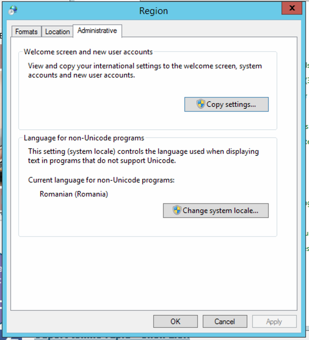

# Setări regionale pentru BizPharma

- [Setări regionale pentru BizPharma](#setări-regionale-pentru-bizpharma)
  - [Introducere](#introducere)
  - [Instrucțiuni pentru efectuarea setărilor](#instrucțiuni-pentru-efectuarea-setărilor)
    - [Deschide setările regionale](#deschide-setările-regionale)
    - [Setează formatele și locația pentru România](#setează-formatele-și-locația-pentru-românia)
    - [Copiază setările la nivel global pentru acest PC](#copiază-setările-la-nivel-global-pentru-acest-pc)
    - [Finalizare](#finalizare)

## Introducere

BizPharma are nevoie obligatorie ca regiunea și formatul datei și al cifrelor pe utilizatorul curent cât și pe întreg sistemul de operare, să fie setate pe `Romanian`, altfel pot apărea erori evidente iar alteori mai puțin evidente și mai greu de depistat.

Spre exemplu, va afișa și/sau stoca numere cu zecimale greșite, dăți cu luna și ziua inversată sau va genera anumite erori în timpul executării aplicației.

## Instrucțiuni pentru efectuarea setărilor

Urmăriți acești pași pentru efectuare setărilor necesare.

Este recomandat ca aceste setări să fie făcute chiar la instalarea sistemului de operare, înainte de instalarea aplicațiilor, inclusiv BizPharma.

### Deschide setările regionale

Se deschid setările regionale, fie prin rularea appletului `Intl.cpl`:

fie, prin deschiderea `Control Panel` &rarr; `Regional Settings` sau `Region` (în modul de vedere tip Listă):

### Setează formatele și locația pentru România

După ce apare fereastra `Region`, din primul tab numit `Formats`, alege formatul pentru `Romanian (Romania)`.

Din al doilea tab numit `Location`, alege locația `Romania`.

### Copiază setările la nivel global pentru acest PC

Din al treilea tab numit `Administrative`, copiază setările prin apăsarea butonului `Copy settings...`:

Apare fereastra de copiere numită `Welcome screen and new user accounts settings`:

Bifați tot imediat deasupra butoanelor sau sub lista afișată.

- [x] Welcome screen and system accounts
- [x] New user accounts

Apăsați `OK`.

> ### ATENȚIE
>
> `Display language` (limba de afișare a interfeței Windows) poate să rămână pe Engleză (`English`), nu afeactează BizPharma, însă celelalte limbi și formate trebuie să fie pe `Romanian (Romania)` sau `Romanian (Romania) - US`.
>
> Cele trei cuvinte au semnificația următoare:\
> `Limbă (Locație) - Tastatură`

Din fereastra `Region` de mai devreme, setați și regiunea sistemului de operare pentru aplicațiile care nu suportă Unicode.
Dați click pe butonul `Change system locale...` și schimbați system locale în `Romanian (Romania)`:

### Finalizare

Reporniți sistemul de operare înainte să reporniți BizPharma.
